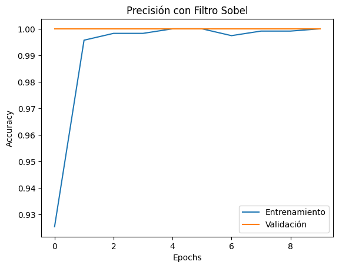
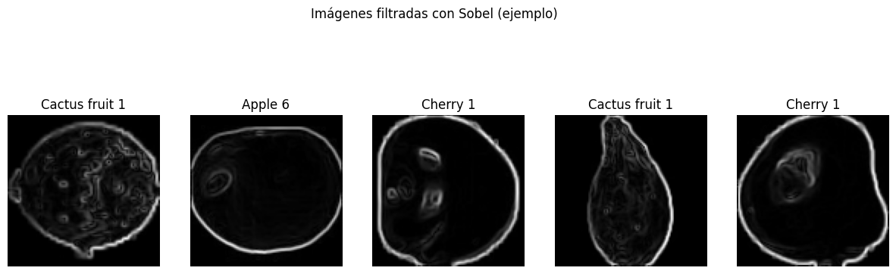

# Proyecto 2: Clasificación de Imágenes con Filtro Sobel - Fruits 360

Este proyecto aplica una red neuronal convolucional (CNN) para clasificar imágenes de frutas. Antes de entrenar, se utiliza el filtro de Sobel para resaltar los bordes de las frutas. Esto permite experimentar con el preprocesamiento de imágenes y observar su impacto en el rendimiento del modelo.

---

## Objetivo

Entrenar un modelo de clasificación de frutas que utilice imágenes con filtro Sobel aplicado previamente, para explorar los efectos del procesamiento de bordes en el aprendizaje profundo.

---

## Base de datos utilizada: Fruits 360

- Cada clase de fruta está en su propia carpeta.
- Usamos una submuestra de 3 frutas para entrenar más rápido.
- Link de referencia: [GitHub - Fruit-Images-Dataset](https://github.com/Horea94/Fruit-Images-Dataset)

---

## Justificación del modelo y del preprocesamiento

- El filtro **Sobel** permite resaltar contornos en las imágenes, lo cual puede mejorar la generalización del modelo al enfocarse en la forma en lugar del color.
- Se utiliza una red **CNN** por su eficiencia y alta precisión en tareas de visión por computadora.
- El modelo es sencillo pero suficiente para detectar diferencias entre frutas en base a sus bordes.

---

## Flujo general del proyecto

1. Montar Google Drive.
2. Preparar el dataset en la ruta `/content/drive/MyDrive/...`.
3. Aplicar el filtro Sobel a las imágenes durante la carga.
4. Crear y entrenar un modelo CNN.
5. Evaluar el modelo y visualizar resultados.

---

## Modelo utilizado

- `Conv2D` + `MaxPooling2D` (2 bloques)
- `Flatten`
- `Dense(128)` + `Dropout(0.5)`
- Capa final `Dense` con `softmax`
- Pérdida: `categorical_crossentropy`
- Optimizador: `Adam`

---

## Resultados esperados

- Gráfica de precisión de entrenamiento y validación por época.
- Imágenes con sus etiquetas verdaderas y predichas.

---

## Interpretación de la gráfica de precisión

La gráfica muestra la evolución de la precisión del modelo a lo largo de las épocas para:

- **Entrenamiento** (`accuracy`) → muestra qué tan bien el modelo aprende los datos con los que entrena.
- **Validación** (`val_accuracy`) → muestra qué tan bien el modelo generaliza a datos nuevos no vistos.

Si ambas curvas suben juntas, el modelo está aprendiendo bien y generalizando correctamente. Si `accuracy` sube pero `val_accuracy` baja, puede indicar **sobreajuste**.

Esta gráfica es una herramienta clave para diagnosticar el comportamiento del modelo y tomar decisiones de mejora.

---
 Resultados

---

## Análisis

Este proyecto combina técnicas clásicas de visión por computadora (filtros de detección de bordes) con aprendizaje profundo. El uso del filtro Sobel transforma las imágenes para resaltar sus bordes, eliminando información como el color y centrándose en las formas y contornos. Esto permite al modelo entrenarse con un enfoque más estructural y menos sensible a variaciones de iluminación o textura.

---

## Conclusiones

- La detección de bordes puede ser una herramienta poderosa para mejorar la generalización de modelos en tareas visuales.
- El preprocesamiento con Sobel permite que la red aprenda características más abstractas (como siluetas).
- Combinar técnicas clásicas (filtros) con modernas (CNN) puede ser muy efectivo.
- Incluso un modelo sencillo puede obtener buenos resultados al enfocarse en los bordes.
- Este tipo de experimento puede extenderse a otros filtros o redes más complejas para nuevos estudios.

---

## Autora

**Alejandra Penagos**  
Licenciatura en Física, Facultad de Ciencias Físico-Matemáticas  
Curso de Deep Learning  
Abril 2025

